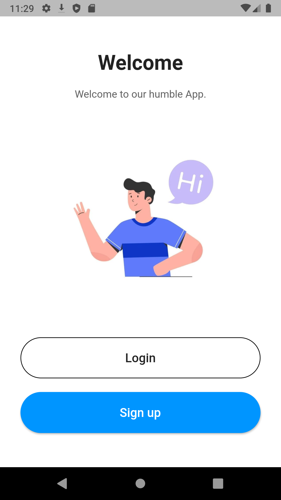
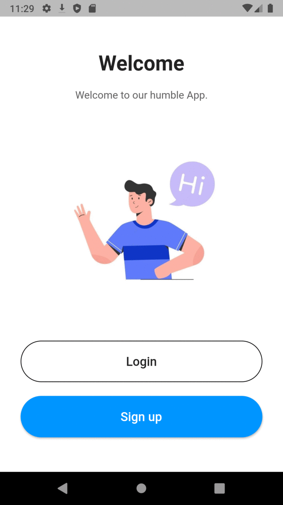

# Graduation Project Task

A simple Flutter app. based on SQFlite database to signup/login and apply simple functions inside. 

## Getting Started
1- make sure you have the latest package installed and a working emulator installed (The project won't work properly using flutter web).

2- run the app using the following command: `flutter run --no-sound-null-safety `. PS: Building the app usually takes couple minutes. So, please be patient.

3-start by creating a new account and use it to login.

4- Have fun!

## Screenshots

------------------------------------------------------------------------------------------------
GIF:

## Our Team
    * Mostafa Mahmoud 
    * Hassan Fathy 
    * Yasser Nasser
